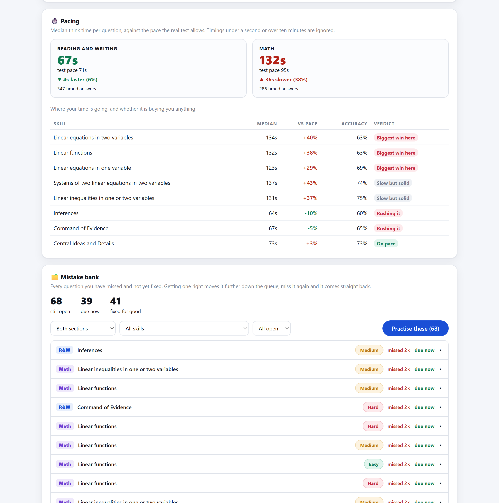

<div align="center">

# SAT Trainer

**An offline, adaptive SAT practice app that looks and feels like Bluebook.**

Bring your own free question export from the College Board question bank and get
a full practice environment: adaptive difficulty, timed modules, a complete
section-adaptive practice test, the Desmos calculator, and progress analytics
that tell you which skills are actually improving.

No install. No server. No account. No data leaves your computer.

</div>

---

## Contents

- [What it does](#what-it-does)
- [Screenshots](#screenshots)
- [Setup](#setup)
- [How the adaptive engine works](#how-the-adaptive-engine-works)
- [The four practice modes](#the-four-practice-modes)
- [How the full test is scored](#how-the-full-test-is-scored)
- [The review loop](#the-review-loop)
- [Keeping your progress safe](#keeping-your-progress-safe)
- [Progress tracking](#progress-tracking)
- [Where the questions come from](#where-the-questions-come-from)
- [Troubleshooting](#troubleshooting)
- [How it works under the hood](#how-it-works-under-the-hood)
- [Project layout](#project-layout)
- [Changelog](#changelog)
- [Licence](#licence)

---

## What it does

| | |
|---|---|
| **Adaptive difficulty** | Every question has a difficulty and so do you; your ability moves further for a hard question than an easy one, and the picker aims just below it. Tracked per skill, and tunable. |
| **Real test interface** | Two-pane Reading and Writing layout, Mark for Review, ABC answer eliminator, highlighting, question navigator, hideable timer — modelled on Bluebook. |
| **Full practice test** | All four modules, 98 questions, the 10-minute break, and a second module routed by your first-module performance. Scored the way the real one is - IRT, difficulty-weighted, guessing discounted. |
| **Math tools** | The Desmos graphing calculator and the official SAT reference sheet, available exactly where the real test gives them to you. |
| **Brings back your mistakes** | Miss a question and it returns on a spacing ladder — 10 minutes, then 1, 3, 7, 21 days — until you can get it right. |
| **Pacing** | Median think time per question against real test pace, per skill, so you can see where the clock is going. |
| **Gamified** | XP with a combo multiplier, levels, a daily goal, a day streak, and 36 badges. |
| **Analytics** | Accuracy over time, per-domain mastery, and explicit "improving" and "needs attention" lists computed per skill. |
| **Custom drills** | Pick individual skills, a difficulty, a question count, and optionally a clock sized to that count at real test pace. |
| **Save files** | Progress is mirrored to a file you own, and restored automatically on launch — not trapped in browser storage. |
| **Private** | Everything runs from `file://` in your browser. Nothing is uploaded. |

Works in Chrome, Edge, Firefox and Safari on desktop.

---

## Screenshots




*No screenshots of the question view are included, because those would reproduce
College Board question content. Run it yourself to see the Bluebook-style
interface.*

---

## Setup

Takes about five minutes, most of it waiting for the extractor.

### 1. Get the code

```bash
git clone https://github.com/kubinokitsune/sat-trainer.git
cd sat-trainer
```

Or download the ZIP from the green **Code** button and unzip it.

### 2. Install the one dependency

The app itself needs nothing. The PDF converter needs Python 3.9+ and PyMuPDF:

```bash
py -3 -m pip install -r requirements.txt
```

On macOS or Linux use `python3 -m pip install -r requirements.txt`.

### 3. Export your questions from the College Board

1. Open **<https://satsuitequestionbank.collegeboard.org>** — it is free and needs no account.
2. Choose **SAT**, tick **Reading and Writing**, select the questions you want
   (select all for the full bank — roughly 1,800 questions).
3. **Export → PDF**, and make sure **"Include correct answer and rationale"** is ticked.
4. Repeat for **Math**.
5. Put both PDFs in the `question-banks/` folder.

Filenames don't matter — the extractor reads each PDF and works out which
section it is.

### 4. Build the question data

```bash
py -3 tools/extract.py
```

This takes **10–20 minutes** for the full bank, because every Math question is
rendered from the PDF (see [under the hood](#how-it-works-under-the-hood)).
You'll see progress as it goes. It produces roughly **110 MB** in `data/`.

### 5. Open the app

Double-click **`index.html`**. That's it.

---

## How the adaptive engine works

Every question carries a difficulty on a shared scale, and so does your ability.
After each answer your estimate moves — further for a hard question than an easy
one, and further early on than once it has settled.

```
   easier  ←────────────────  your ability  ────────────────→  harder
            Easy  −1.1          Medium  0.0          Hard  +1.1
                          ▲
             the picker aims a little below you, so you get
                  about 70% right and still get stretched
```

That target is adjustable under **Settings** (50–88%, default 70%) — drop it and
the mix gets harder, raise it and you stay on ground you have covered. Ability is
tracked per section *and* per skill, with thin skills shrunk toward your section
average so one bad run on Circles doesn't crater the whole thing.

Practice then prefers questions you have never seen, biases toward your weakest
skills, and reserves about a third of the run for [questions you previously
missed](#the-review-loop).

> **Prefer the old behaviour?** Settings → *Stepped* restores the original
> engine: a set number right in a row moves the level up, a set number wrong
> moves it down, with both thresholds editable. The ability estimate keeps
> updating underneath either way, so switching never loses it.

The **Progress** page shows where you are currently working and what that pace
would be worth across a full section.

---

## The four practice modes

**Adaptive practice** — endless questions with immediate feedback and the full
official explanation after every answer, including why each wrong choice is wrong.
This is the mode that tracks your ability, and about a third of it is spent back on
questions you previously missed.

**Timed module** — one real module against the real clock: 27 questions in
32 minutes for Reading and Writing, 22 in 35 minutes for Math. No feedback until
you submit.

**Full practice test** — all four modules, 98 questions, 2 h 14 m, with the break
and the adaptive second module. Modules are built to the real domain blueprint
(a Reading and Writing module comes out 8/7/7/5 across the four domains, in
test-day order) and end with an estimated score.

**Custom drill** — pick a section, then tick the exact **skills** you want from a
topic tree that shows how many questions each one holds. Set a difficulty, choose
how many questions, and optionally start a clock. The suggested time is that many
questions at real test pace (71s each for Reading and Writing, 95s for Math), and
you can drag it anywhere between half and double that.

---

## How the full test is scored

Not raw-correct over total. The digital SAT is IRT-scored, and so is this.

Each question has a **difficulty** and a **discrimination** (how sharply it
separates strong from weak), and multiple-choice questions carry a **guessing
floor** of 1-in-4. Your section score is the ability those 54 or 44 responses
imply, mapped onto 200-800 and rounded to the nearest 10.

Three things fall out of that, all of which match the real thing:

- **Which questions you got right matters,** not only how many. Two people on
  the same raw score usually land 10-20 points apart, the one who cleared the
  hard items higher.
- **Guessing doesn't pay.** Answering a whole section at random lands near 200
  rather than in the middle, because a 1-in-4 hit rate is exactly what the model
  expects from no knowledge at all.
- **The module you were routed to caps you.** Module 2's difficulty is decided
  by the ability your module 1 answers imply, and the easier route caps the
  section at 650 - as on test day.

Some reference points for Math (44 questions):

| Raw score | Estimated |
|---|---|
| 44 | 800 |
| 40 | 670 |
| 33 | 580 |
| 22 | 470-480 |
| ~11 (random) | 200 |

> **This is a model, not the official table.** The College Board does not
> publish its conversion and it changes with every form. Item difficulties here
> come from the Easy/Medium/Hard labels in your export, not from real
> calibration data. Treat the number as a well-grounded estimate - good for
> tracking whether you are improving, not for predicting your exact score.

---

## The review loop

Practice only raises a score if the questions you got wrong come back. They do.

Miss a question and it enters a spacing ladder:

```
        miss                 get it right at each step
         │        10 min  →  1 day  →  3 days  →  7 days  →  21 days  →  fixed
         └──────────────────────────── miss again ───────────────────────────┘
```

The first step is only ten minutes, so a miss reappears in the same sitting,
which is where it actually sticks. Get it right and it moves up; miss it again
and it drops back to the front with its miss count going up. Survive the whole
ladder and it is retired as **fixed**.

About a third of an adaptive practice run is spent on questions that are due,
each marked **🔁 Review** so you know why it came back.

The dashboard watches the clock, so the moment something falls due the banner
turns amber and offers **Review now** by itself — no reloading, and no waiting
until you next navigate. Returning to a tab you left open refreshes it at once.

> This closed a real hole. The picker prefers questions you have never seen, and
> with banks of ~1,800 questions per section there are always unseen ones — so
> before this, a question you got wrong would essentially never be shown to you
> again.

### The mistake bank

On **Progress & analytics** you get every question you have missed and not yet
fixed. Filter by section, by skill, or to just what is due; expand any row for
the full question, the correct answer and the official explanation; or hit
**Practise these** to turn the current filter into a session.

### Pacing

The same page reports your median think time per question against the pace the
real test allows — 71s for Reading and Writing, 95s for Math — and breaks it
down by skill:

| Verdict | Meaning |
|---|---|
| **On pace** | At or under time, and accurate |
| **Rushing it** | Fast, but missing them |
| **Slow but solid** | Over time, but you are getting them right |
| **Biggest win here** | Slow *and* inaccurate — start here |

Timings under a second or over ten minutes are dropped, and it reports medians,
so one tab left open overnight cannot skew it.

---

## Keeping your progress safe

By default the app stores progress in your browser. That is fine day to day, but
clearing site data wipes it, and it does not follow you to another computer. So
progress can also live in a **save file you own**.

Open **Settings → Save file**:

| | |
|---|---|
| **Link a save file…** | Chrome and Edge only. Pick a file once and every answer is written to it as you go — and the link is picked back up when you reload. |
| **Download a copy** | Works everywhere. Saves `save.js` through the normal download flow. |
| **Load from file…** | Restore from any save file you have. |

### Make it restore itself

Save the file as **`data/save.js`** inside the project folder. `index.html` loads
that file on launch, so your progress comes back by itself — even if the browser
forgot everything.

The neatest setup is to click **Link a save file…** and point it straight at
`data/save.js`. From then on the app writes to it as you practise and reads it
back the next time you open the page.

Restoring never overwrites silently. If the file is older than what is already in
the browser, the app says so and shows both timestamps and question counts before
you decide.

### Does it stay linked?

Yes. **Reloading the page keeps the link** — the file handle is remembered, so
the app reconnects on its own and carries on writing without asking.

The one exception is a full browser restart: browsers may drop the *write
permission* even though the file is still remembered. When that happens you get
a one-click **allow writing again** on the dashboard rather than having to find
the file a second time. And if you keep the file at `data/save.js`, your
progress loads on launch regardless of whether writing has been re-permitted
yet.

---

## Progress tracking

The **Progress & analytics** screen gives you:

- accuracy over time for both sections on a shared axis, most recent on the right
- questions answered per day for the last 30 days
- accuracy split by difficulty, so you can see whether Hard is actually landing
- mastery bars for every domain
- **Where you are improving** — skills whose recent accuracy beats the block before it
- **Needs attention** — skills that are slipping, or simply your weakest
- every skill ranked by accuracy, and your full-test score history

All computed from your own answer history in `localStorage`. **Settings → Reset
all progress** wipes it, as does clearing site data for the page.

---

## Where the questions come from

**This repository contains no SAT questions.** Questions, answer explanations and
figures belong to the College Board. You export your own copy for personal study
and the data is generated locally on your machine.

`data/` and `question-banks/*.pdf` are both gitignored. **Don't commit them, and
don't publish a fork that includes them.**

If you want to share this project, share the code and let people run step 3
themselves — it's free and takes two minutes.

---

## Troubleshooting

**"No question bank yet" when I open index.html**
The data hasn't been generated. Work through [Setup](#setup) steps 3 and 4.

**`ModuleNotFoundError: No module named 'pymupdf'`**
Run `py -3 -m pip install -r requirements.txt`. If you have several Pythons
installed, make sure it's the same one you run the script with.

**"No question-bank PDFs found"**
The PDFs aren't in `question-banks/`, or the export didn't include answers and
rationales. Re-export with **"Include correct answer and rationale"** ticked.

**I regenerated the data but the app shows the old questions**
The browser cached the old `data/*.js`. Hard-refresh with **Ctrl+Shift+R**
(**Cmd+Shift+R** on a Mac).

**The extractor skipped some questions**
A handful of questions in the College Board export are defective — artwork that
was never drawn for one of the answer choices, or an answer that exists only
inside the rationale with no text form. Rather than ship a question you cannot
answer, the extractor skips it and names it. On the full bank that is about
9 questions out of 3,770, which is normal.

**The Desmos calculator won't load**
It's fetched from desmos.com, so it needs an internet connection. Everything else
works offline. You'll get a link to Desmos instead of a broken panel.

**I lost my progress / I want it on another computer**
See [Keeping your progress safe](#keeping-your-progress-safe). Save the file as
`data/save.js` and it restores itself on every launch, on any machine you copy
the folder to.

**My progress disappeared**
Progress lives in browser `localStorage` by default, so it is per-browser and
per-machine, and private windows discard it on close. Link a save file (or keep
one at `data/save.js`) and none of that can lose it. If the browser blocks local
storage entirely, the app says so rather than losing work silently.

**Stray `*-<name>.png` files keep appearing in `data/img`**
You've put the project inside a cloud-synced folder (OneDrive, Dropbox, iCloud).
Writing ~9,500 small files in a few minutes makes the sync client create
conflict copies and undo deletions. The app ignores them, but they waste space
and quota. Keep the project outside your synced folders, or exclude `data/`
from sync.

**Nothing happens when I double-click index.html**
Right-click → *Open with* → your browser. If your browser is set to download
`.html` files rather than open them, use that menu.

---

## How it works under the hood

The interesting problem is the PDF conversion, handled by `tools/extract.py`.

**Reading and Writing** questions are real text in the PDF, so they extract
cleanly and passages reflow properly in the two-pane layout. Three quirks needed
handling:

- The export inserts a **0.2 pt space** inside letter pairs like `rt`, so
  "reported" comes out as "repor ted". Real word spaces are 2.2 pt, so the
  extractor drops any space narrower than 1 pt.
- Small caps and smart quotes are emitted as **separate PDF lines** whose `y0`
  differs by about 1 pt from the run they belong to, which scrambles reading
  order ("FABRY" → "ABRY … F"). Spans are regrouped into visual rows by vertical
  overlap, then ordered left to right.
- Bullet points are **drawn as 3 pt squares**, not characters, so note-list
  questions lose their structure. The extractor detects those glyphs and rebuilds
  the list.

**Math** is a different problem: the export draws every equation, graph and table
as **artwork rather than text**. There is no equation text to recover — a
question reads as "In the given equation, and are constants". So Math questions
are rendered as images cropped from the original PDF, tightened to the ink, in
greyscale where the region has no colour. They look exactly as the College Board
typeset them, which is why `data/img` ends up around 100 MB.

Cropping to the ink is where this got interesting. The export uses **three**
different ways to draw the same maths:

- most equations and graphs are **vector paths**;
- fractions, radicals and some graphs are **embedded rasters**;
- everything else is ordinary text.

Measuring only the first and third — which is what the extractor originally did —
means a choice consisting of nothing but a fraction measures as empty and gets
dropped. That silently blanked one or more answer choices on 195 questions, and
hit "which graph shows…" questions hardest, since every option there is a picture.

The second trap is that a raster fraction is roughly **three times the height of
the text row it sits on**. Cropping between one choice's row and the next slices
the numerator off. So each piece of ink is assigned to the choice whose band
contains its *centre*, and a choice's crop is the union of what it owns rather
than the gap between two labels.

The 62 Reading and Writing questions built on a chart get the same treatment for
the graphic only — their axis labels are rotated and don't survive extraction —
while the prose underneath stays selectable text.

---

## Project layout

```
sat-trainer/
├─ index.html            ← open this
├─ assets/
│  ├─ app.js             screens, adaptive engine, Bluebook runner
│  ├─ store.js           progress, XP, badges, analytics
│  ├─ savefile.js        export, import and autosave to a file on disk
│  ├─ charts.js          dependency-free SVG charts
│  ├─ reference.js       SAT reference sheet + Desmos
│  └─ styles.css
├─ tools/
│  ├─ extract.py         PDF → app data
│  └─ patch_missing.py   recovers older-format questions
├─ question-banks/       ← your PDF exports go here (gitignored)
├─ data/                 ← generated question data + save.js (gitignored)
├─ docs/                 screenshots used by this README
├─ CHANGELOG.md
├─ CONTRIBUTING.md
├─ requirements.txt
└─ LICENSE
```

The app has **no build step and no runtime dependencies**. `assets/` is plain
HTML, CSS and JavaScript; charts are hand-rolled SVG so they work offline.

---

## Changelog

See [CHANGELOG.md](CHANGELOG.md) for what changed in each release.

---

## Licence

Code is [MIT licensed](LICENSE) — use it however you like.

The licence covers the code only. SAT question content belongs to the College
Board and is not distributed here. SAT® is a trademark registered by the College
Board, which is not affiliated with and does not endorse this project.
