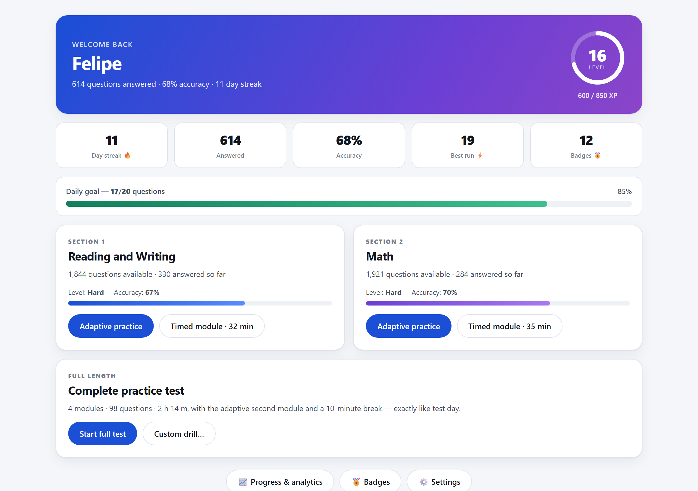
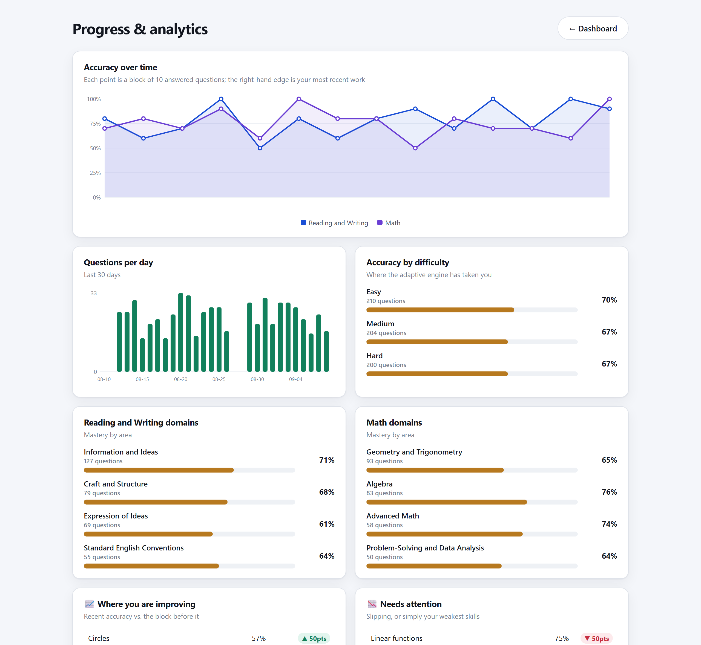

<div align="center">

# SAT Trainer

**An offline, adaptive SAT practice app that looks and feels like Bluebook.**

Bring your own free question export from the College Board question bank and get
a full practice environment: adaptive difficulty, timed modules, a complete
section-adaptive practice test, the Desmos calculator, and progress analytics
that tell you which skills are actually improving.

No install. No server. No account. No data leaves your computer.

</div>

---

## Contents

- [What it does](#what-it-does)
- [Screenshots](#screenshots)
- [Setup](#setup)
- [How the adaptive engine works](#how-the-adaptive-engine-works)
- [The four practice modes](#the-four-practice-modes)
- [Progress tracking](#progress-tracking)
- [Where the questions come from](#where-the-questions-come-from)
- [Troubleshooting](#troubleshooting)
- [How it works under the hood](#how-it-works-under-the-hood)
- [Project layout](#project-layout)
- [Licence](#licence)

---

## What it does

| | |
|---|---|
| **Adaptive difficulty** | Three right in a row moves you up Easy → Medium → Hard; two wrong eases off. Both thresholds are configurable. |
| **Real test interface** | Two-pane Reading and Writing layout, Mark for Review, ABC answer eliminator, highlighting, question navigator, hideable timer — modelled on Bluebook. |
| **Full practice test** | All four modules, 98 questions, the 10-minute break, and a second module whose difficulty is chosen by your first-module score, like the real digital SAT. Ends with an estimated 1600-scale score. |
| **Math tools** | The Desmos graphing calculator and the official SAT reference sheet, available exactly where the real test gives them to you. |
| **Gamified** | XP with a combo multiplier, levels, a daily goal, a day streak, and 15 badges. |
| **Analytics** | Accuracy over time, per-domain mastery, and explicit "improving" and "needs attention" lists computed per skill. |
| **Private** | Everything runs from `file://` in your browser. Progress lives in `localStorage` on your machine. Nothing is uploaded. |

Works in Chrome, Edge, Firefox and Safari on desktop.

---

## Screenshots





*No screenshots of the question view are included, because those would reproduce
College Board question content. Run it yourself to see the Bluebook-style
interface.*

---

## Setup

Takes about five minutes, most of it waiting for the extractor.

### 1. Get the code

```bash
git clone https://github.com/kubinokitsune/sat-trainer.git
cd sat-trainer
```

Or download the ZIP from the green **Code** button and unzip it.

### 2. Install the one dependency

The app itself needs nothing. The PDF converter needs Python 3.9+ and PyMuPDF:

```bash
py -3 -m pip install -r requirements.txt
```

On macOS or Linux use `python3 -m pip install -r requirements.txt`.

### 3. Export your questions from the College Board

1. Open **<https://satsuitequestionbank.collegeboard.org>** — it is free and needs no account.
2. Choose **SAT**, tick **Reading and Writing**, select the questions you want
   (select all for the full bank — roughly 1,800 questions).
3. **Export → PDF**, and make sure **"Include correct answer and rationale"** is ticked.
4. Repeat for **Math**.
5. Put both PDFs in the `question-banks/` folder.

Filenames don't matter — the extractor reads each PDF and works out which
section it is.

### 4. Build the question data

```bash
py -3 tools/extract.py
```

This takes **10–20 minutes** for the full bank, because every Math question is
rendered from the PDF (see [under the hood](#how-it-works-under-the-hood)).
You'll see progress as it goes. It produces roughly **90 MB** in `data/`.

### 5. Open the app

Double-click **`index.html`**. That's it.

---

## How the adaptive engine works

You sit at one of three levels per section, tracked separately for Reading and
Writing and for Math:

```
        3 correct in a row  →
Easy ←────────────────────────→ Medium ←────────────────────────→ Hard
        ←  2 wrong in a row
```

Both thresholds — and your current level, if you want to jump straight to Hard —
are editable under **Settings**.

Within a level the app prefers questions you have never seen, then biases toward
the skills where your accuracy is lowest, so weak spots come up more often.

On the **full practice test** this is replaced by the real exam's behaviour:
module 2's difficulty is decided by your module 1 score, and being routed to the
easier module 2 caps the estimated section score around 620, as it does on test day.

---

## The four practice modes

**Adaptive practice** — endless questions with immediate feedback and the full
official explanation after every answer, including why each wrong choice is wrong.
This is the mode that adjusts difficulty as you go.

**Timed module** — one real module against the real clock: 27 questions in
32 minutes for Reading and Writing, 22 in 35 minutes for Math. No feedback until
you submit.

**Full practice test** — all four modules, 98 questions, 2 h 14 m, with the break
and the adaptive second module. Modules are built to the real domain blueprint
(a Reading and Writing module comes out 8/7/7/5 across the four domains, in
test-day order) and end with an estimated score.

**Custom drill** — pick a section and the exact domains you want to hammer.

---

## Progress tracking

The **Progress & analytics** screen gives you:

- accuracy over time for both sections on a shared axis, most recent on the right
- questions answered per day for the last 30 days
- accuracy split by difficulty, so you can see whether Hard is actually landing
- mastery bars for every domain
- **Where you are improving** — skills whose recent accuracy beats the block before it
- **Needs attention** — skills that are slipping, or simply your weakest
- every skill ranked by accuracy, and your full-test score history

All computed from your own answer history in `localStorage`. **Settings → Reset
all progress** wipes it, as does clearing site data for the page.

---

## Where the questions come from

**This repository contains no SAT questions.** Questions, answer explanations and
figures belong to the College Board. You export your own copy for personal study
and the data is generated locally on your machine.

`data/` and `question-banks/*.pdf` are both gitignored. **Don't commit them, and
don't publish a fork that includes them.**

If you want to share this project, share the code and let people run step 3
themselves — it's free and takes two minutes.

---

## Troubleshooting

**"No question bank yet" when I open index.html**
The data hasn't been generated. Work through [Setup](#setup) steps 3 and 4.

**`ModuleNotFoundError: No module named 'pymupdf'`**
Run `py -3 -m pip install -r requirements.txt`. If you have several Pythons
installed, make sure it's the same one you run the script with.

**"No question-bank PDFs found"**
The PDFs aren't in `question-banks/`, or the export didn't include answers and
rationales. Re-export with **"Include correct answer and rationale"** ticked.

**The extractor skipped some questions**
A handful of questions in the College Board export are defective — a missing
answer choice, or an answer that exists only as an image inside the rationale
with no text form. The extractor names each one it skips. A few out of thousands
is normal.

**The Desmos calculator won't load**
It's fetched from desmos.com, so it needs an internet connection. Everything else
works offline. You'll get a link to Desmos instead of a broken panel.

**My progress disappeared**
Progress lives in browser `localStorage`, so it's per-browser and per-machine, and
private windows discard it on close. If the browser blocks local storage entirely,
the app tells you rather than losing work silently.

**Nothing happens when I double-click index.html**
Right-click → *Open with* → your browser. If your browser is set to download
`.html` files rather than open them, use that menu.

---

## How it works under the hood

The interesting problem is the PDF conversion, handled by `tools/extract.py`.

**Reading and Writing** questions are real text in the PDF, so they extract
cleanly and passages reflow properly in the two-pane layout. Three quirks needed
handling:

- The export inserts a **0.2 pt space** inside letter pairs like `rt`, so
  "reported" comes out as "repor ted". Real word spaces are 2.2 pt, so the
  extractor drops any space narrower than 1 pt.
- Small caps and smart quotes are emitted as **separate PDF lines** whose `y0`
  differs by about 1 pt from the run they belong to, which scrambles reading
  order ("FABRY" → "ABRY … F"). Spans are regrouped into visual rows by vertical
  overlap, then ordered left to right.
- Bullet points are **drawn as 3 pt squares**, not characters, so note-list
  questions lose their structure. The extractor detects those glyphs and rebuilds
  the list.

**Math** is a different problem: the export draws every equation, graph and table
as **vector artwork rather than text**. There is no equation text to recover — a
question reads as "In the given equation, and are constants". So Math questions
are rendered as images cropped from the original PDF, tightened to the ink, in
greyscale where the region has no colour. They look exactly as the College Board
typeset them, which is why `data/img` ends up around 90 MB.

The 62 Reading and Writing questions built on a chart get the same treatment for
the graphic only — their axis labels are rotated and don't survive extraction —
while the prose underneath stays selectable text.

---

## Project layout

```
sat-trainer/
├─ index.html            ← open this
├─ assets/
│  ├─ app.js             screens, adaptive engine, Bluebook runner
│  ├─ store.js           progress, XP, badges, analytics
│  ├─ charts.js          dependency-free SVG charts
│  ├─ reference.js       SAT reference sheet + Desmos
│  └─ styles.css
├─ tools/
│  ├─ extract.py         PDF → app data
│  └─ patch_missing.py   recovers older-format questions
├─ question-banks/       ← your PDF exports go here (gitignored)
├─ data/                 ← generated question data (gitignored)
├─ requirements.txt
└─ LICENSE
```

The app has **no build step and no runtime dependencies**. `assets/` is plain
HTML, CSS and JavaScript; charts are hand-rolled SVG so they work offline.

---

## Licence

Code is [MIT licensed](LICENSE) — use it however you like.

The licence covers the code only. SAT question content belongs to the College
Board and is not distributed here. SAT® is a trademark registered by the College
Board, which is not affiliated with and does not endorse this project.
